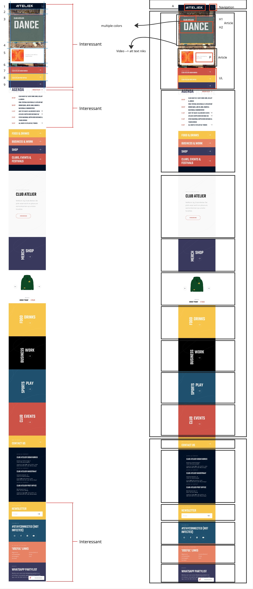
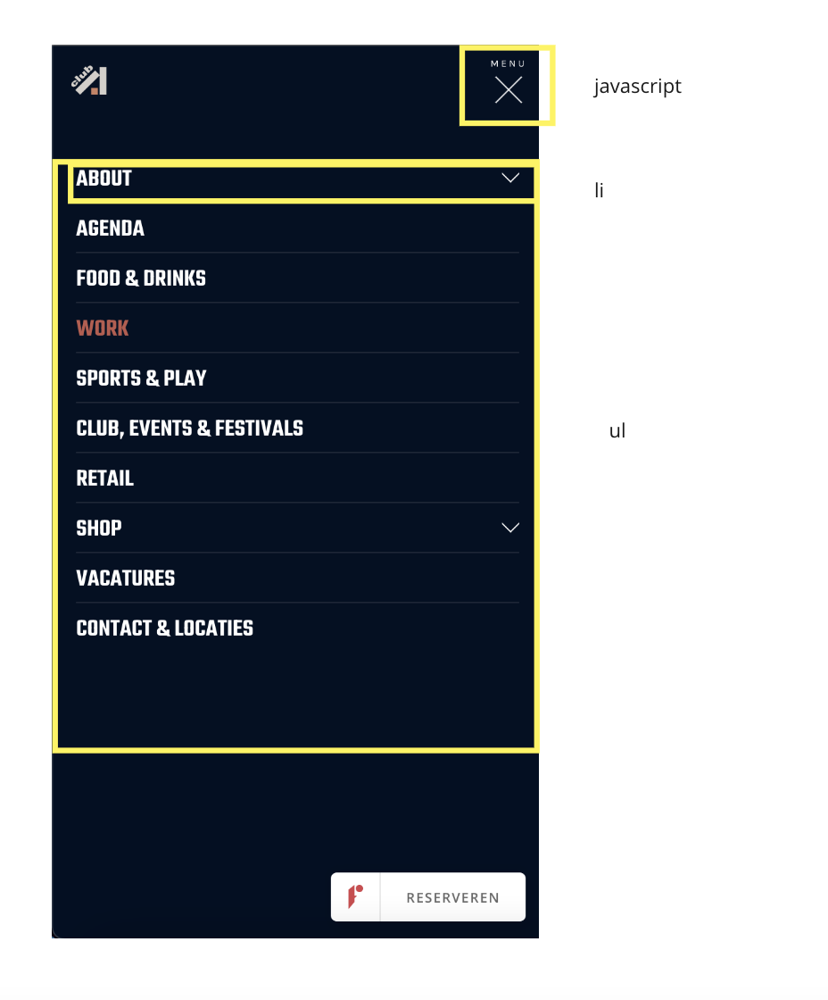
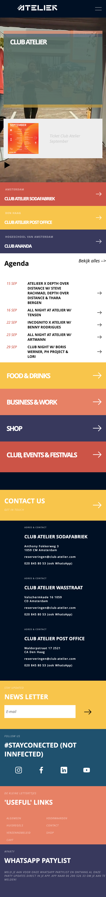
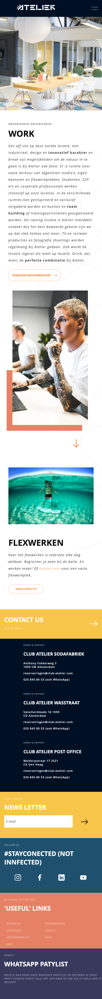
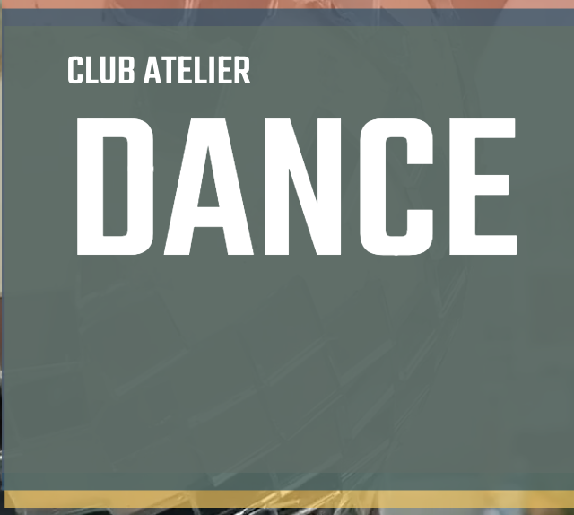
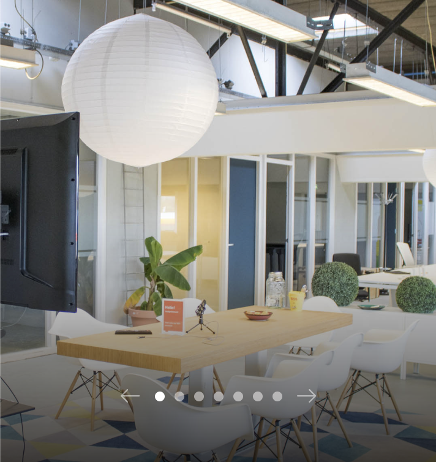
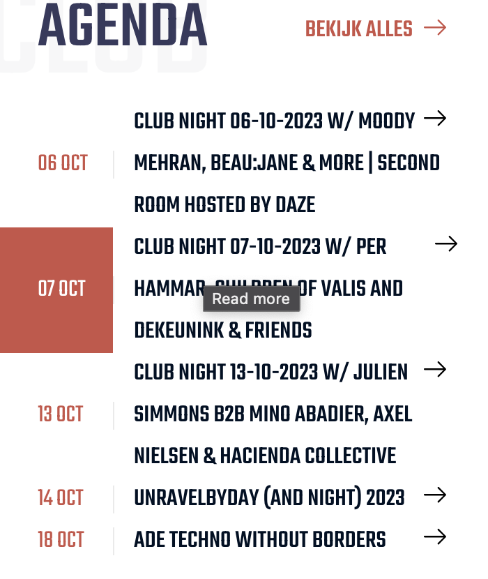

# Procesverslag
Markdown is een simpele manier om HTML te schrijven.  
Markdown cheat cheet: [Hulp bij het schrijven van Markdown](https://github.com/adam-p/markdown-here/wiki/Markdown-Cheatsheet).

Nb. De standaardstructuur en de spartaanse opmaak van de README.md zijn helemaal prima. Het gaat om de inhoud van je procesverslag. Besteedt de tijd voor pracht en praal aan je website.

Nb. Door *open* toe te voegen aan een *details* element kun je deze standaard open zetten. Fijn om dat steeds voor de relevante stuk(ken) te doen.

## Jij

  
uitwerken voor kick-off werkgroep

  ### Auteur:
  Ananda van der Meulen
  #### Je startniveau:
  Blauw
  #### Je focus:
  Mijn focus ligt op Surface plane.
  - video/geluid
  - Dark/light mode
  - prefers-reduced motion
  - animaties
  - micro interacties
  - formulieren
  - advanced positioning
 

## Je website

  
uitwerken voor kick-off werkgroep

  ### Je opdracht:
  https://www.club-atelier.nl/
  -Het is een site die horizontaal werkt (ipv verticaal)

  #### Screenshot(s) van de eerste pagina (small screen): 
  hier de naam van de pagina  
  

  #### Screenshot(s) van de tweede pagina (small screen):
  hier de naam van de pagina  
  
 

## Toegankelijkheidstest 1/2 (week 1)

  
uitwerken na test in 2e werkgroep

### Bevindingen
  Lijst met je bevindingen die in de test naar voren kwamen:
  Zie img hierboven.

  - het viel mij op dat er veel teksten/details niet worden voorgelezen door de screenreader.
  - De volgorde van lezen is niet logisch, bijv eerst de p en daana h2 etc.
  - img geen alt
  - geen dark/light mode
  - geen reduced motion
  - geen knop om video's op pauze te zetten

## Breakdownschets (week 1)

  
uitwerken na afloop 3e werkgroep

  ### de hele pagina: 
  

  ### dynamisch deel (bijv menu): 
  

## Voortgang 1 (week 2)

  
uitwerken voor 1e voortgang

  ### Stand van zaken
Deze week heb ik me flink beziggehouden met CSS en JavaScript. Na wat herhaling kwam alles weer naar boven, maar eerlijk gezegd vind ik het nog steeds behoorlijk pittig. Ik doe mijn best om alles goed te doen, maar het kan soms even duren.

Daarnaast ben ik begonnen met mijn eigen website. Ik heb de HTML voor het eerste gedeelte van de site in elkaar gezet. Nu ben ik bezig met het menu in CSS en JavaScript. Dat is nog een uitdaging. Ik weet wat ik wil maken, maar om dat in programmeertaal te vertalen of de juiste zoektermen te bedenken vind ik lastig. Ondanks dit merk ik dat het met de les beter gaat.

Desondanks wil ik mijn project goed afronden en veel leren. Het leerproces is uitdagend, maar ik ben enthousiast om nieuwe dingen te leren en mijn website tot leven te brengen.

  ### Agenda voor meeting
  samen met je groepje opstellen

  | Alia           | Kim                | Ananda       | Valentijn        |
  | ---            | ---                | ---          | ---              |
  | dit bespreken  | en dit             | en ik dit    | en dan ik dat    |
  | en dat ook nog | dit als er tijd is | nog een punt | dit wil ik zeker |
  | ...            | ...                | ...          | ...              |

  ### Verslag van meeting
  We zijn langs elke website gegaan en hebben bepaalde vragen gesteld aan de studentassistenten. Het lukte bij mij niet om de navigatie te laten werken. Ik heb hier daarom mijn vragen over gesteld. Eenmaal klaar met de meeting met ik aan de slag gegaan met de navigatie en het toch aan de praat gekregen.

## Voortgang 2 (week 3)

  
uitwerken voor 2e voortgang

  ### Stand van zaken
Deze week heb ik de belangrijkste inhoud van mijn website opgeschreven en ben ik begonnen met de css te verbeteren. In het bovenste gedeelte van de pagina heb ik een video als achtergrond gebruikt, maar ik had wat moeite om deze naar de achtergrond te verplaatsen, zodat andere dingen eroverheen gezet kunnen worden. Uiteindelijk heb ik ontdekt dat ik dit kan doen door een soort van "volgorde" aan te geven met z-index.

Ook was ik wat tijd kwijt aan het vlak waar de span in staat. deze moesten om de beurt te voorschijn komen. Dit heb ik gedaan dmv keyframes en een linear gradient te plaatsen op de achtergrond zodat er 4 vlakken te zien zijn. Na alles te hebben uitgevogeld en veel voorgang heb gemaakt zag ik opeens een wit vlak aan de rechterkant van boven naar beneden van ongeveer 40vw. Ik heb geen idee waar dit is mis gegaan in de css, ik heb daarom Bahaa een berichtje op team gestuurd. Ik wacht nog op het antwoord.

Ik probeer ook te leren hoe ik een bepaalde indeling kan maken voor mijn pagina, maar dat lukt nog niet helemaal goed. Daarom ga ik in onze volgende meeting vragen stellen om te begrijpen hoe ik dit beter kan doen. Ik ben blij met de voortgang die ik heb gemaakt.

  ### Agenda voor meeting
  samen met je groepje opstellen (Zie excel bestand)

  | Ananda         |Kim                 | Alia         | Valentijn        |
  | ---            | ---                | ---          | ---              |
  | Grid op site?  | en dit             | en ik dit    | en dan ik dat    |
  | van mobile naar| dit als er tijd is | nog een punt | dit wil ik zeker |
  | desktop?       | ...                | ...          | ...              |
  | Waar komt het  | ...                | ...          | ...              |
    witte vlak vandaan?

  ### Verslag van meeting
  hier na afloop snel de uitkomsten van de meeting vastleggen

- witte vlak is weg
- grid uitleg over welke child ik moet pakken
-  position relative/absolute

## Toegankelijkheidstest 2/2 (week 4)

  
uitwerken na test in 9e werkgroep

  ### Bevindingen
  Lijst met je bevindingen die in de test naar voren kwamen (geef ook aan wat er verbeterd is):

  - Slaat h2 in article over bij agenda
  - alt bij knop pause toevoegen
  - Slaat agenda en ades & contact over
  - Geeft bij de captions geen captions aan
  - bij settings animation en motion uit
  - contrast is overal goed te lezen

## Voortgang 3 (week 4)

  
uitwerken voor 3e voortgang

  ### Stand van zaken
  hier dit ging goed & dit was lastig (neem ook screenshots op van delen van je website en code)

  ### Agenda voor meeting
  samen met je groepje opstellen

  | Ananda         | Alia               | Kim          | Valentijn        |
Mijn vragen:
Moet het formulier verstuurd worden?
Dark/light mode, welke kleuren?
Mag ik een class op een button voor javascript?

  ### Verslag van meeting
 Na de vergadering heb ik snel de belangrijkste punten opgeschreven. Tijdens het bekijken van de verschillende websites kreeg ik beter zicht op wat er mogelijk is. De vragen die ik had, werden duidelijk beantwoord, waardoor ik weer verder kon met mijn werk. Hierdoor kon ik weer door werken.

## Eindgesprek (week 5)

  
uitwerken voor eindgesprek

  ### Je uitkomst - karakteristiek screenshots:
  
  

  ### Dit ging goed/Heb ik geleerd: 
De 'work eat sport dance' animatie vond ik lastig. Dit heb ik uiteindelijk gemaakt door alle woorden in een span te zttenn en hier een begin/eind tijd aan vast te koppelen. ik heb hier veel van geleerd.

Ook de carusel vond ik uitdagend, ik heb dit nog niet eerder gemaakt. ondanks dit heeft david mij alles goed uitgelegd en geholpen waar nodig was.
  
  

  ### Dit was lastig/Is niet gelukt:
Het is mij niet volledig gelukt om de agenda hover exact na te maken. Ik heb daarom mijn prioriteit bij de andere onderdelen gelegd. Mocht ik langer te tijd hadden, dan was ik hier mee aan de slag gegaan.

  

## Bronnenlijst

  
continu bijhouden terwijl je werkt

  Nb. Wees specifiek ('css-tricks' als bron is bijv. niet specifiek genoeg). 
  Nb. ChatGpT en andere AI horen er ook bij.
  Nb. Vermeld de bronnen ook in je code.

  1. bron 1 pause button video -> chatgpt
  2. bron 2 carusel pagina 2 -> David
  3. bron 3 span animation -> Quinten
  4. bron 4 mental support -> kimposibble
  5. bron 5 nav animation -> werkgroep van sanne

